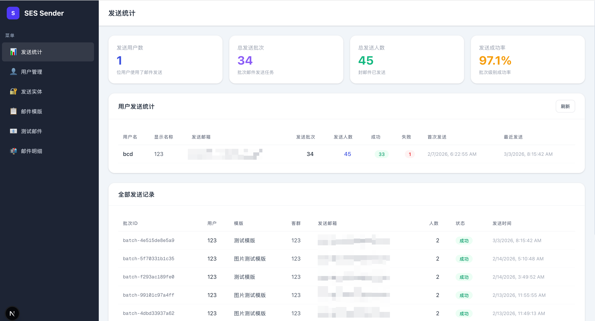
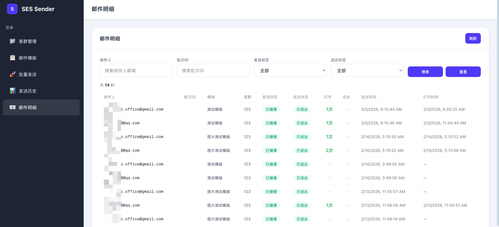

# SES Sender

A bulk email management platform built on AWS SES with a separated frontend/backend architecture. Supports multi-user, role-based access control, contact group management, bulk sending, and deliverability tracking.

## Screenshots

**Admin Panel**



**User Panel**



## Features

### Admin

| Feature | Description |
|---------|-------------|
| User Management | Create/edit/disable users, assign dedicated sending emails, set daily sending quota, reset passwords |
| Sending Identities | Verify email addresses and domains (SES Identity) |
| Email Templates | Create/edit/delete templates (isolated per user), supports `{{name}}` variables, AI-powered optimization |
| Test Email | Send test emails using verified identities with custom content |

### Regular Users

| Feature | Description |
|---------|-------------|
| Dashboard | Personal sending stats: today/month/total volume, daily quota progress, delivery/open rates, 7-day trend chart |
| Contact Groups | Create/edit/delete groups with search and pagination |
| Contact Management | Bulk add contacts, Excel import/export/template download, custom JSON attributes |
| Email Templates | Each user maintains independent templates (create/edit/delete), live HTML preview, AI-powered optimization |
| Bulk Sending | Select template and target group, async sending with auto rate limiting, daily quota check, skips unsubscribed contacts |
| Scheduled Sending | One-time scheduled send, daily/weekly/monthly recurring send, pause/resume support, auto-executed by background scheduler |
| Sending History | View historical records with real-time progress, click to see delivery rate, open rate, and other metrics per batch |
| Email Details | Dedicated page with search/filter for per-email delivery status, open/click tracking |
| Unsubscribe Management | View and manage unsubscribed users, restore sending capability |

## Tech Stack

| Layer | Technology |
|-------|-----------|
| Backend | Python / FastAPI / SQLAlchemy / Alembic / Boto3 |
| Frontend | Next.js 16 / React / Tailwind CSS / TypeScript |
| Database | MySQL 8 |
| Auth | JWT (python-jose) + bcrypt |
| Monitoring | AWS CloudWatch + SES VDM (Virtual Deliverability Manager) |
| Event Tracking | SNS → SQS → Backend polling (per-email delivery/open/click/bounce) |
| AI Optimization | AWS Bedrock (Claude) — intelligent email template optimization |
| Unsubscribe | RFC 8058 one-click unsubscribe, HMAC-SHA256 signed tokens |
| Deployment | Docker / Docker Compose, frontend reverse-proxies backend API (single port exposure) |

## Project Structure

```
ses-sender/
├── docker-compose.yml
├── .env.example
├── setup-ses-events.sh          # One-click SNS+SQS setup script
│
├── backend/
│   ├── main.py                  # Entry point, Alembic migration + SQS polling + scheduler + route registration
│   ├── alembic/                 # Database migrations
│   │   ├── env.py
│   │   └── versions/
│   ├── core/                    # Infrastructure layer
│   │   ├── config.py            #   Configuration
│   │   ├── database.py          #   Database connection
│   │   ├── deps.py              #   Auth & permission dependencies
│   │   ├── ses.py               #   AWS SES v1/v2 clients + send quota
│   │   └── unsubscribe.py       #   Unsubscribe token generation/verification (HMAC-SHA256)
│   └── domain/                  # Business domains (DDD)
│       ├── auth/                #   Auth: login, user management
│       ├── identity/            #   Sending identities: SES email/domain verification
│       ├── template/            #   Email templates: per-user isolated CRUD + AI optimization
│       ├── audience/            #   Audience: groups, contacts, custom attributes, Excel
│       └── sending/             #   Sending: async bulk send, scheduled send, history, metrics, unsubscribe
│
└── frontend/
    └── app/
        ├── page.tsx             # Single-page app (Login / Admin panel / User panel)
        └── api/[...path]/route.ts  # API reverse proxy (forwards to backend)
```

Each business domain contains:
- `models.py` — Database entities
- `schemas.py` — Request/response models
- `service.py` — Business logic
- `router.py` — API routes

## Quick Start

### 1. Prerequisites

- Docker & Docker Compose
- EC2 instance with an IAM Role that has SES and CloudWatch permissions (no AK/SK needed)

### 2. Configuration

```bash
cp .env.example .env
```

Edit `.env` as needed:

```env
# AWS Region
AWS_REGION=us-east-1

# SES Configuration Set (for VDM tracking, leave empty to skip)
SES_CONFIGURATION_SET=ses-sender-tracking

# SQS Queue URL (for per-email event tracking, leave empty to skip)
SQS_QUEUE_URL=

# Unsubscribe base URL (public-facing URL for one-click unsubscribe, leave empty to skip)
UNSUBSCRIBE_BASE_URL=

# AI template optimization (AWS Bedrock, leave empty to disable)
BEDROCK_MODEL_ID=global.anthropic.claude-opus-4-6-v1
BEDROCK_REGION=us-east-1

# MySQL
MYSQL_ROOT_PASSWORD=ses_sender_root_123
MYSQL_DATABASE=ses_sender
MYSQL_USER=ses_sender
MYSQL_PASSWORD=ses_sender_123
```

### 3. Start

```bash
docker-compose up -d --build
```

On first start, the backend automatically runs database migrations (Alembic) and creates the default admin account.

### 4. Access

| Service | URL |
|---------|-----|
| Frontend | http://localhost:3000 |
| API (via frontend proxy) | http://localhost:3000/api/* |

> The backend API is only accessible within the Docker internal network (port 8000 is not exposed externally). All API requests are forwarded through the Next.js frontend reverse proxy.

### 5. Default Admin

```
Username: admin
Password: admin123
```

> Change the password immediately after first login.

## VDM Deliverability Tracking Setup

### How It Works

```
Bulk email sending
  ↓
SES sesv2.send_email() (per recipient)
  ├── ConfigurationSetName: "ses-sender-tracking"    ← VDM association
  ├── EmailTags:
  │     ├── batch_id: "batch-a1b2c3d4e5f6"           ← Unique batch identifier
  │     ├── user_id: "2"                              ← Sending user
  │     └── ...
  └── Headers:
        ├── List-Unsubscribe: <url>                   ← One-click unsubscribe
        └── List-Unsubscribe-Post: ...
  ↓
CloudWatch Metrics (by batch_id dimension)
  → Send / Delivery / Open / Bounce / Complaint / Click
  ↓
SNS → SQS → Backend SQS Worker
  → Per-email event tracking (delivery, bounce, open, click, complaint)
  ↓
Sending History → "View Metrics" → Real-time deliverability dashboard
Email Details → Per-email status with search/filter
```

### Configuration Steps

#### Step 1: Create Configuration Set

```bash
aws sesv2 create-configuration-set \
  --configuration-set-name ses-sender-tracking \
  --delivery-options TlsPolicy=OPTIONAL \
  --sending-options SendingEnabled=true \
  --reputation-options ReputationMetricsEnabled=true \
  --region us-east-1
```

#### Step 2: Disable Suppression List

```bash
aws sesv2 put-configuration-set-suppression-options \
  --configuration-set-name ses-sender-tracking \
  --suppressed-reasons \
  --region us-east-1
```

#### Step 3: Configure VDM Options (Disable Optimized Shared Delivery)

```bash
aws sesv2 put-configuration-set-vdm-options \
  --configuration-set-name ses-sender-tracking \
  --vdm-options '{
    "DashboardOptions": {"EngagementMetrics": "ENABLED"},
    "GuardianOptions": {"OptimizedSharedDelivery": "DISABLED"}
  }' \
  --region us-east-1
```

> **Important**: `OptimizedSharedDelivery` must be set to `DISABLED`, otherwise emails may be delayed or not delivered in sandbox mode.

#### Step 4: Add CloudWatch Event Destination

```bash
aws sesv2 create-configuration-set-event-destination \
  --configuration-set-name ses-sender-tracking \
  --event-destination-name cloudwatch \
  --event-destination '{
    "Enabled": true,
    "MatchingEventTypes": ["SEND", "DELIVERY", "BOUNCE", "COMPLAINT", "OPEN", "CLICK"],
    "CloudWatchDestination": {
      "DimensionConfigurations": [
        {
          "DimensionName": "batch_id",
          "DimensionValueSource": "MESSAGE_TAG",
          "DefaultDimensionValue": "no_tag"
        }
      ]
    }
  }' \
  --region us-east-1
```

#### Step 5: Enable Account-Level VDM

```bash
aws sesv2 put-account-vdm-attributes \
  --vdm-attributes '{
    "VdmEnabled": "ENABLED",
    "DashboardAttributes": {"EngagementMetrics": "ENABLED"},
    "GuardianAttributes": {"OptimizedSharedDelivery": "DISABLED"}
  }' \
  --region us-east-1
```

#### Step 6: Configure SNS + SQS Event Destination (Per-Email Tracking)

The system uses an **SNS → SQS → Backend polling** architecture to receive SES events. No public-facing endpoint required.

**One-click setup:**

```bash
# Arg 1: AWS Region (required)  Arg 2: Configuration Set name (optional, default: ses-sender-tracking)
./setup-ses-events.sh us-east-1
# or
./setup-ses-events.sh ap-northeast-1 my-config-set
```

The script automatically:
1. Gets your AWS Account ID
2. Creates SNS Topic (`ses-sender-events`)
3. Creates SQS Queue (`ses-sender-events-queue`) with long polling and message retention
4. Sets SQS queue policy to allow SNS to send messages
5. Creates SNS → SQS subscription
6. Adds SNS Event Destination to the SES Configuration Set (tracking SEND/DELIVERY/BOUNCE/COMPLAINT/OPEN/CLICK/REJECT)

After completion, the script outputs the variables to add to `.env`.

<details>
<summary>Manual setup commands (click to expand)</summary>

```bash
# 6.1 Create SNS Topic
aws sns create-topic \
  --name ses-sender-events \
  --region <REGION>

# 6.2 Create SQS Queue
aws sqs create-queue \
  --queue-name ses-sender-events-queue \
  --attributes '{
    "ReceiveMessageWaitTimeSeconds": "20",
    "VisibilityTimeout": "300",
    "MessageRetentionPeriod": "1209600"
  }' \
  --region <REGION>

# 6.3 Get SQS Queue ARN
aws sqs get-queue-attributes \
  --queue-url <QUEUE_URL> \
  --attribute-names QueueArn \
  --region <REGION>

# 6.4 Set SQS queue policy (allow SNS to send messages)
# Refer to setup-ses-events.sh for the policy JSON

# 6.5 Subscribe SNS Topic → SQS
aws sns subscribe \
  --topic-arn <TOPIC_ARN> \
  --protocol sqs \
  --notification-endpoint <QUEUE_ARN> \
  --attributes '{"RawMessageDelivery": "false"}' \
  --region <REGION>

# 6.6 Add SNS Event Destination to Configuration Set
aws sesv2 create-configuration-set-event-destination \
  --configuration-set-name <CONFIG_SET> \
  --event-destination-name sns-events \
  --event-destination '{
    "Enabled": true,
    "MatchingEventTypes": ["SEND", "DELIVERY", "BOUNCE", "COMPLAINT", "OPEN", "CLICK", "REJECT"],
    "SnsDestination": {
      "TopicArn": "<TOPIC_ARN>"
    }
  }' \
  --region <REGION>
```

</details>

#### Step 7: Set Environment Variables and Restart

```bash
# Edit .env, add SQS_QUEUE_URL
SES_CONFIGURATION_SET=ses-sender-tracking
SQS_QUEUE_URL=https://sqs.us-east-1.amazonaws.com/YOUR_ACCOUNT_ID/ses-sender-events-queue

# Recreate containers (restart does NOT pick up new env vars)
docker-compose down && docker-compose up -d
```

Verify SQS Worker started:

```bash
docker-compose logs -f backend | grep "SQS Worker"
# Expected: [SQS Worker] 启动，队列: https://sqs.us-east-1.amazonaws.com/...
```

#### Step 8: Verify Configuration

```bash
# Check Configuration Set
aws sesv2 get-configuration-set \
  --configuration-set-name ses-sender-tracking \
  --region us-east-1

# Check Event Destinations
aws sesv2 get-configuration-set-event-destinations \
  --configuration-set-name ses-sender-tracking \
  --region us-east-1

# Check backend env vars
docker exec ses-sender-backend env | grep SES_CONFIGURATION
```

### Viewing Metrics

After configuration:
1. Send a batch of emails through the platform
2. **Wait 15 minutes** (CloudWatch metrics have a 5-15 minute delay)
3. In "Sending History", click **"View Metrics"**
4. The modal displays delivery rate, open rate, bounce rate, etc.

> **Note**: Only batches sent with `SES_CONFIGURATION_SET` active will have metrics data.

### Troubleshooting: All Metrics Show 0

| # | Check | Action |
|---|-------|--------|
| 1 | `SES_CONFIGURATION_SET` env var | `docker exec ses-sender-backend env \| grep SES_CONFIGURATION` |
| 2 | Configuration Set exists | `aws sesv2 get-configuration-set --configuration-set-name <name>` |
| 3 | CloudWatch Event Destination configured | `aws sesv2 get-configuration-set-event-destinations --configuration-set-name <name>` — must have `batch_id` dimension |
| 4 | `AWS_REGION` matches | Backend region must match SES/CloudWatch region |
| 5 | VDM enabled | `aws sesv2 get-account` — check `VdmEnabled: ENABLED` |
| 6 | Waited long enough | CloudWatch needs 5-15 minutes after sending |
| 7 | Verify in CloudWatch console | CloudWatch → Metrics → `AWS/SES` → look for `batch_id` dimension |
| 8 | IAM permissions | EC2 role needs `cloudwatch:GetMetricStatistics`, `cloudwatch:ListMetrics` |

### FAQ

| Issue | Cause | Solution |
|-------|-------|----------|
| **All metrics are 0** | No CloudWatch Event Destination | Run Step 4 (most common) |
| **All metrics are 0** | AWS_REGION mismatch | Ensure `AWS_REGION` matches SES/CloudWatch region |
| **All metrics are 0** | `SES_CONFIGURATION_SET` not applied | Use `docker-compose down && up -d` instead of `restart` |
| **Open/Click are 0** | VDM not enabled | Run Step 5 to enable account-level VDM |
| Emails not received after adding Config Set | Suppression List active | Disable Suppression List on Config Set |
| Emails not received after adding Config Set | Optimized Shared Delivery | Disable at account and Config Set level |
| Emails not received after adding Config Set | TLS Policy set to REQUIRE | Change to OPTIONAL |
| Env var changes don't take effect | `docker-compose restart` | Use `docker-compose down && docker-compose up -d` |

## One-Click Unsubscribe

The system supports Gmail/Yahoo one-click unsubscribe requirements (RFC 8058):

- Every email includes `List-Unsubscribe` and `List-Unsubscribe-Post` headers (when `UNSUBSCRIBE_BASE_URL` is configured)
- `POST /unsubscribe` — RFC 8058 handler (called by email clients automatically)
- `GET /unsubscribe` — Confirmation page ("Successfully Unsubscribed")
- Unsubscribed recipients are automatically skipped in future sends
- Unsubscribe tokens use HMAC-SHA256 signing to prevent forgery

**Setup**: Set `UNSUBSCRIBE_BASE_URL` in `.env` to your public-facing backend URL (e.g., `https://api.example.com`).

## Upgrade Guide

### Upgrade to Latest Version

```bash
# 1. Pull latest code
cd ses-sender
git pull origin main

# 2. Check for new environment variables (compare with .env.example)
diff <(sort .env) <(sort .env.example)
# Add any new variables to .env as needed

# 3. Rebuild and restart (database migrations run automatically)
docker-compose down
docker-compose up -d --build

# 4. Verify services are running
docker-compose ps
docker-compose logs --tail=10 backend | grep Alembic
```

### Upgrade Notes

| Item | Details |
|------|---------|
| Database migration | Alembic auto-runs `upgrade head` on backend startup |
| MySQL data | Persisted in `./data/mysql/`, preserved during upgrades |
| Uploaded files | Persisted in `./data/uploads/`, preserved during upgrades |
| Environment variables | New versions may add variables — compare with `.env.example` before upgrading |
| Restart method | Must use `docker-compose down && up -d --build`, NOT `restart` |

### Rollback

```bash
# View version history
git log --oneline -10

# Roll back to a specific version
git checkout <commit-hash>
docker-compose down && docker-compose up -d --build

# Roll back database migration if needed
docker exec ses-sender-backend alembic downgrade -1
```

## Database Migrations

The project uses Alembic for database versioning. Migrations run automatically on service startup.

```bash
# Generate new migration (after modifying models)
docker exec ses-sender-backend alembic revision --autogenerate -m "description"

# Copy migration files to local
docker cp ses-sender-backend:/app/alembic/versions/ backend/alembic/versions

# Manually run migrations
docker exec ses-sender-backend alembic upgrade head

# Check current version
docker exec ses-sender-backend alembic current

# View migration history
docker exec ses-sender-backend alembic history
```

## Common Operations

```bash
# Service status
docker-compose ps

# View logs
docker logs ses-sender-backend
docker logs ses-sender-frontend
docker logs ses-sender-mysql

# Restart services
docker-compose restart

# Stop services
docker-compose down

# Rebuild and start
docker-compose up -d --build

# Recreate containers (apply env var changes)
docker-compose down && docker-compose up -d

# MySQL shell
docker exec -it ses-sender-mysql mysql -u ses_sender -pses_sender_123 ses_sender
```

## IAM Permissions

The EC2 instance IAM Role requires the following permissions:

```json
{
  "Effect": "Allow",
  "Action": [
    "ses:ListIdentities",
    "ses:GetIdentityVerificationAttributes",
    "ses:VerifyEmailIdentity",
    "ses:VerifyDomainIdentity",
    "ses:ListTemplates",
    "ses:CreateTemplate",
    "ses:UpdateTemplate",
    "ses:DeleteTemplate",
    "ses:SendEmail",
    "ses:SendBulkTemplatedEmail",
    "sesv2:SendEmail",
    "sesv2:CreateEmailTemplate",
    "sesv2:UpdateEmailTemplate",
    "sesv2:DeleteEmailTemplate",
    "sesv2:GetAccount",
    "cloudwatch:GetMetricStatistics",
    "cloudwatch:ListMetrics",
    "sns:CreateTopic",
    "sns:Subscribe",
    "sqs:ReceiveMessage",
    "sqs:DeleteMessage",
    "sqs:GetQueueAttributes",
    "bedrock:InvokeModel"
  ],
  "Resource": "*"
}
```

## Important Notes

1. **SES Sandbox Mode**: New accounts are in sandbox mode by default — can only send to verified emails. Request production access via AWS Console.
2. **Sending Rate Limit**: The system automatically queries `MaxSendRate` from SES and adjusts batch size accordingly (`min(MaxSendRate, 50)` emails per second with 1-second pauses between batches).
3. **Async Sending**: Bulk sends run asynchronously in background threads. The API returns immediately with a batch ID, and progress can be polled in real-time from the sending history page.
4. **Sending Email**: Each user's sending email is configured by the admin. After domain verification, any `user@yourdomain.com` format can be assigned.
5. **Template Isolation**: Each user maintains independent templates. SES template names are auto-prefixed per user to avoid conflicts.
6. **SQS Event Tracking**: When `SQS_QUEUE_URL` is configured, the backend polls SQS for per-email events (delivery, bounce, open, click, complaint). If not configured, the service starts normally without event tracking.
7. **Frontend Reverse Proxy**: The frontend acts as a reverse proxy for all API requests (`/api/*` → backend:8000). Only port 3000 needs to be exposed externally.
8. **Configuration Set Notes**:
   - Must disable Suppression List and Optimized Shared Delivery
   - TLS Policy should be set to OPTIONAL
   - After changing env vars, use `docker-compose down && docker-compose up -d` — `restart` won't apply changes

## AI Email Template Optimization

Intelligent email template optimization powered by AWS Bedrock (Claude):

- One-click analysis of email templates across deliverability, open rate, click rate, mobile responsiveness, compliance, and HTML quality
- AI automatically generates optimized subject line and HTML content
- Side-by-side comparison of original and optimized content (subject and HTML preview)
- **Iterative refinement**: If unsatisfied with AI results, provide modification suggestions and let AI re-optimize based on your feedback
- One-click apply to template editor

**Setup**: Set in `.env`:
```env
BEDROCK_MODEL_ID=global.anthropic.claude-opus-4-6-v1
BEDROCK_REGION=us-east-1
```

**IAM Permission**: Requires `bedrock:InvokeModel`.

## Custom Contact Attributes

Contacts support custom JSON attributes for email personalization:

- Set key-value pair attributes for each contact (e.g., `company`, `city`, `plan`)
- Excel import: columns beyond `name` and `email` are automatically recognized as custom attributes
- Excel export: custom attributes are expanded into separate columns
- Use `{{attribute_name}}` in email templates (e.g., `{{company}}`, `{{city}}`)
- Attributes are automatically replaced during email sending

## Daily Sending Quota

Admins can set a daily email sending limit per user (default 1000 emails/day):

- Admin sets `daily_send_limit` when creating/editing users; user list shows quota usage progress bar
- System checks daily sent count before sending; rejects with HTTP 429 if exceeded
- User bulk send page displays quota progress bar (used/remaining/total) with adaptive colors
- Quota resets daily at UTC midnight

## Dashboard

Each user's default landing page shows a personal stats dashboard:

- **Stat cards**: Today's sends, monthly sends, all-time total, successful batches
- **Quota progress bar**: Today's usage vs daily limit with adaptive colors (green/orange/red)
- **7-day trend**: Bar chart showing daily send volume
- **Delivery metrics**: Delivery rate, open rate, click rate, bounce rate, complaint rate (with progress bars)
- **Recent sends**: Last 5 batch summaries

## Scheduled Sending

Supports one-time and recurring automatic email sending:

| Type | Description |
|------|-------------|
| One-time | Send at a specific future date/time, auto-marks as "completed" after execution |
| Daily | Automatically sends every day at a specified time (UTC) |
| Weekly | Automatically sends on a specified day of the week at a specified time |
| Monthly | Automatically sends on a specified day of the month at a specified time |

**How it works**:
- Background scheduler thread checks for due tasks every 30 seconds (`next_run_at <= now` and `status = active`)
- Triggers `send_bulk_email()` on due tasks — respects all existing rules (quota, unsubscribe filtering, rate limiting)
- Recurring tasks automatically calculate the next execution time after each run
- Supports pause/resume/delete operations
- Execution results (batch ID, errors) are recorded on the task

## AI Coding Assistant Support

The project includes instruction files for multiple AI coding tools:

| File | Tool |
|------|------|
| `AGENTS.md` | Universal (Claude Code / Kiro / any AI tool) |
| `CLAUDE.md` | Claude Code |
| `.github/copilot-instructions.md` | GitHub Copilot |
| `.cursor/rules/ses-sender.md` | Cursor |

## License

MIT
